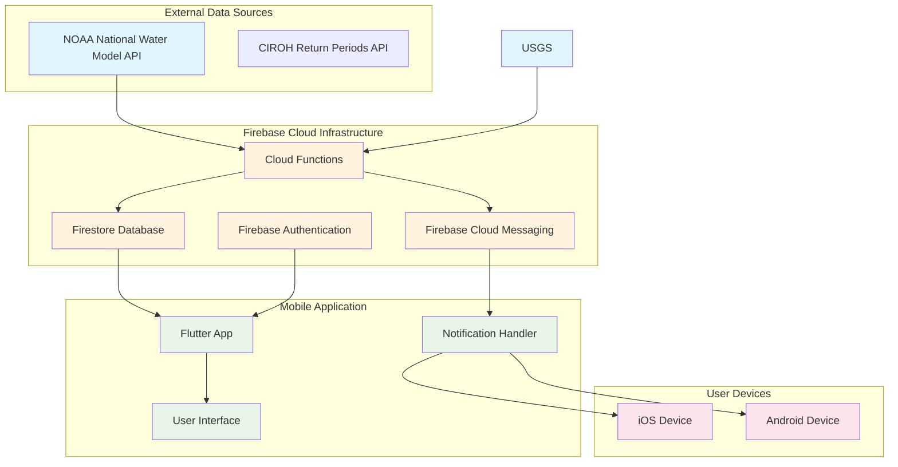
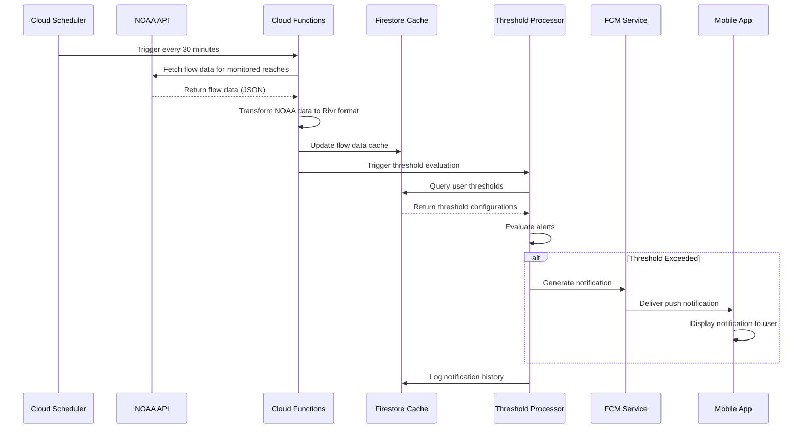
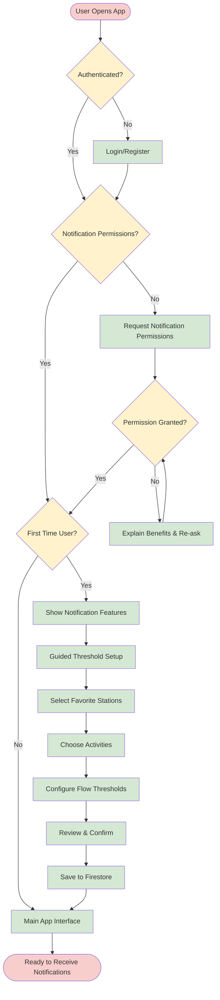
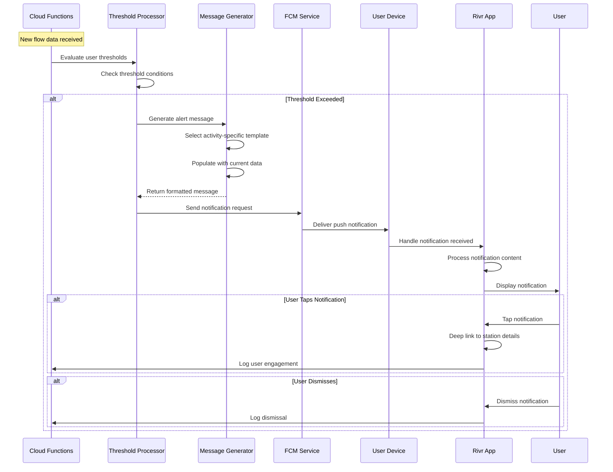
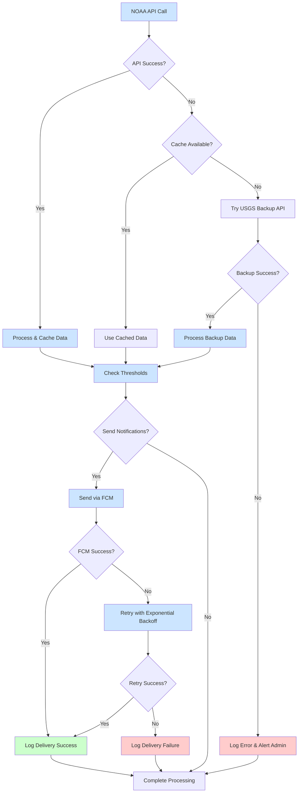
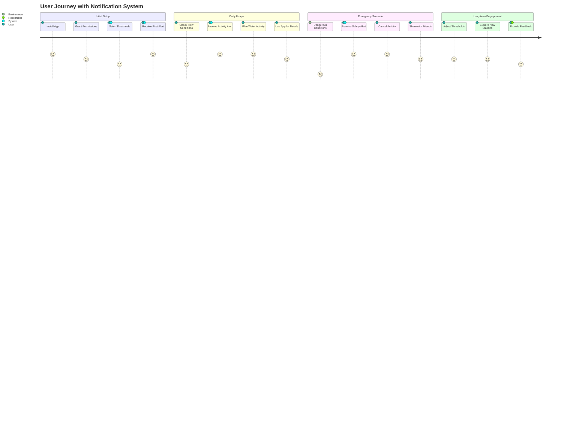
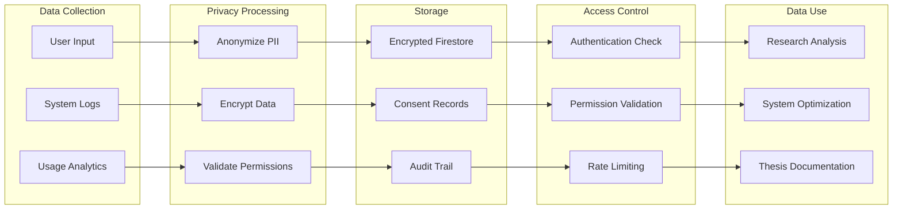
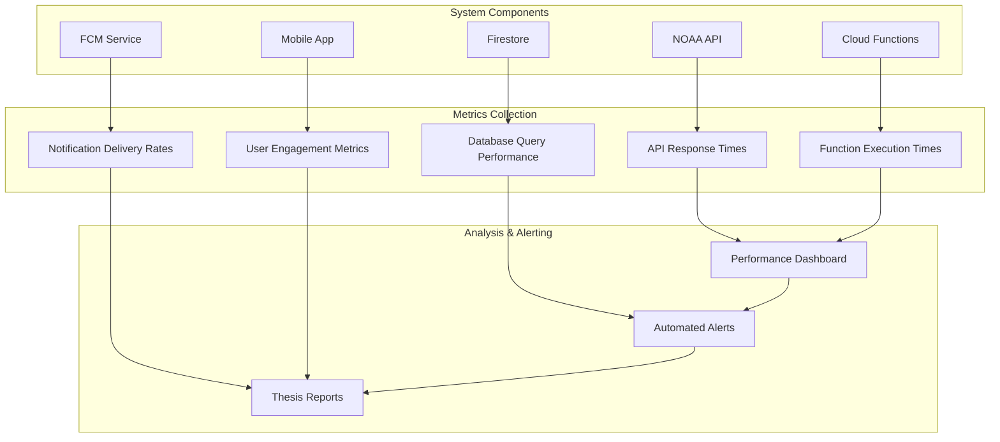
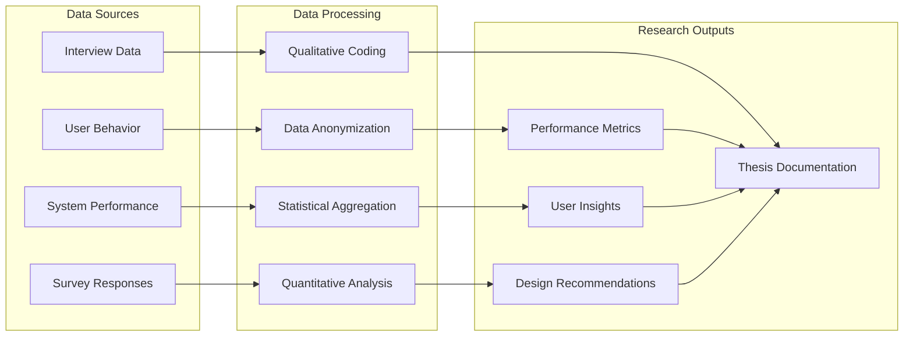

# System Flow Diagrams for Thesis Documentation

## Overview of System Flow Diagrams

This document provides comprehensive flow diagrams for the Rivr notification system, designed to support thesis documentation and demonstrate the complete system architecture, data flows, and user interactions.

## 1. High-Level System Architecture Flow

## 2. Data Ingestion and Processing Flow

## 3. User Onboarding and Setup Flow

## 4. Threshold Creation and Management Flow

```mermaid
flowchart LR
    subgraph "User Interface"
        SETTINGS[Settings Screen]
        THRESHOLD_LIST[Threshold List]
        CREATE_FORM[Create Threshold Form]
        EDIT_FORM[Edit Threshold Form]
    end
    
    subgraph "Form Components"
        STATION_SELECT[Station Selection]
        ACTIVITY_SELECT[Activity Type]
        VALUE_INPUT[Threshold Value]
        TYPE_SELECT[Alert Type]
        PREVIEW[Preview Message]
    end
    
    subgraph "Backend Processing"
        VALIDATE[Validation]
        FIRESTORE[Save to Firestore]
        UPDATE_SUBS[Update Cloud Function Subscriptions]
    end
    
    subgraph "Confirmation"
        SUCCESS[Success Message]
        TEST_NOTIF[Send Test Notification]
    end
    
    SETTINGS --> THRESHOLD_LIST
    THRESHOLD_LIST --> CREATE_FORM
    THRESHOLD_LIST --> EDIT_FORM
    
    CREATE_FORM --> STATION_SELECT
    STATION_SELECT --> ACTIVITY_SELECT
    ACTIVITY_SELECT --> VALUE_INPUT
    VALUE_INPUT --> TYPE_SELECT
    TYPE_SELECT --> PREVIEW
    
    PREVIEW --> VALIDATE
    VALIDATE --> FIRESTORE
    FIRESTORE --> UPDATE_SUBS
    UPDATE_SUBS --> SUCCESS
    SUCCESS --> TEST_NOTIF
    
    EDIT_FORM --> STATION_SELECT
```

## 5. Real-time Notification Delivery Flow

## 6. Error Handling and Fallback Flow

## 7. User Interaction and Engagement Flow

## 8. Data Privacy and Security Flow

## 9. Performance Monitoring Flow

## 10. Thesis Research Data Flow

## Flow Diagram Usage in Thesis

### Architecture Documentation
- Use diagrams 1, 2, and 8 to explain system architecture in methodology section
- Include diagrams 6 and 9 to demonstrate reliability and error handling

### User Experience Analysis
- Diagram 3 and 7 for user onboarding and engagement analysis
- Diagram 4 for threshold configuration usability studies

### Technical Implementation
- Diagrams 2, 5, and 6 for detailed technical implementation discussion
- Use for troubleshooting and system validation

### Research Methodology
- Diagram 10 for explaining data collection and analysis procedures
- Diagram 8 for privacy and ethical considerations

### Results Presentation
- Performance metrics visualization using diagram 9 patterns
- User journey analysis using diagram 7 framework

These flow diagrams provide comprehensive visual documentation of the notification system architecture, supporting both technical implementation and academic thesis requirements.